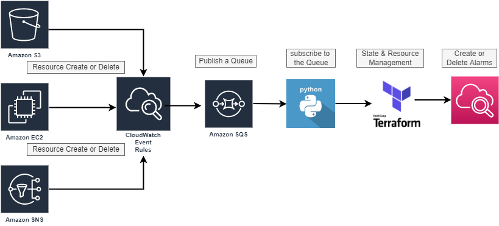

# monitoring-framework

## Architecture



# AWS Cloud Resource Monitoring Automation

This process automates the creation and deletion of **CloudWatch Alarms** based on resource events in AWS.

## 📌 Overview

This system listens for AWS resource creation and deletion events, processes them, and manages **CloudWatch Alarms** accordingly.

## 🛠️ Workflow

1. A **User or Service Account** creates or deletes resources in the AWS Cloud.
2. An **AWS EventBridge Rule** is triggered when a resource is created or deleted.
3. The **EventBridge Rule** sends a message to an **Amazon SQS Target Queue**.
4. An **SQS Listener (Python Script)** continuously polls the queue for new messages.
5. Upon receiving a message, the script extracts and analyzes key event details:
   - **Resource Type** (e.g., EC2, S3)
   - **Event Type** (Creation or Deletion)
6. Based on the event type, the script performs the following actions:
   - **Creation Event:** Creates CloudWatch Alarms with the help of Terraform.
   - **Deletion Event:** Deletes corresponding CloudWatch Alarms with the help of Terraform.`.
7. After processing, the script removes the message from the queue.
8. Testing and validation ensure the system operates correctly.

## 🚀 Getting Started

### Prerequisites
- AWS Account with appropriate permissions
- AWS EventBridge, SQS, and CloudWatch configured
- Python environment with AWS SDK (`boto3`)

### Installation
1. Clone the repository:
   ```sh
   git clone <repository-url>
   cd <repository-folder>
   ```
2. Install dependencies:
   ```sh
   pip install -r requirements.txt
   
   ```
3. Configure AWS credentials:
   ```sh
   [profile personal]
   aws_access_key_id=AKI***
   aws_secret_access_key=****
   region=us-east-1
   output=json
   ```

### Running the Listener Script
```sh
python sqs_listener.py
```

## 📋 Testing
- Ensure an AWS resource is created or deleted to trigger the workflow.
- Check CloudWatch Alarms for expected changes.
- Verify that messages are removed from the SQS queue after processing.

## 📖 License
This project is licensed under the MIT License.
